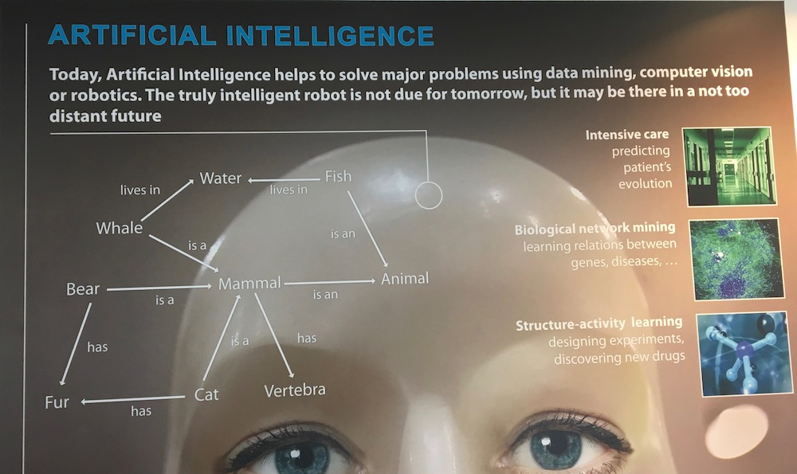
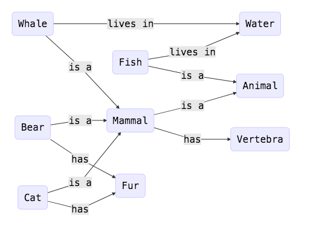
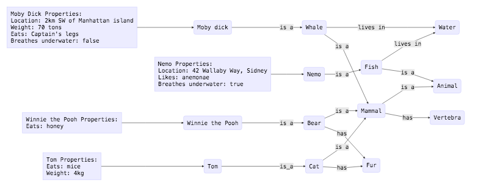

# Understanding models, meta-models and composability + a simple example

Hey everyone,

[Michael](mailto:michaelchikezie.okoli@student.kuleuven.be) and I met up today so we could discuss and clarify the concepts of graphs, models, metamodels and composability. Here are our thoughts on it using a simple example that we serendipitously found on the 200A building.

## The example

We were on the Computer Science 200A building discussing about what a higher order model would look like when we turned to our right and saw this poster:

The graph on the left seems to us like a good, simple example of what a perception graph should look like: there are three layers of modeling (Species, Class and Kingdom), and relations between nodes.

We then drew the graph to have a closer look:

## Models and metamodels

As we understand it, if the term "model" means an abstract entity that represents an aspect that exists in the real world, the diagram made us realize metamodels are the higher-order nodes defined by the "is-a" relations. So, for example, "Mammal" is a meta-model for "Bear" but "Fur" is not.

### Grounding

In order to ground the graph, we have to add _metric information_, that is, information that can accurately differentiate a given _instance_ of that model from other instances. So we can extend the last graph to:

This way, we have four nodes that each belong to different metamodels. Three of them belong to the same meta-metamodel (Mammals) and all of them share a meta-meta-metamodel (Animal). With enough concrete information, it is possible to envision a robot performing a task on this graph, e.g., an autonomous ship that will look for Moby Dick by driving to its location 2km off of Manhattan island and scanning sea density fluctuations to find a 70-ton object. The whale-finding algorithm would be the grounding of the model.

### Composability

On a previous e-mail, Prof. Herman asked to provide examples of composability to differentiate between a model and its implementation. So, in the context of the Animal graph, we believe the higher-order model is the information itself about the nodes, its properties and its relations, while the implementation is the querying machine that takes a model and outputs results.

The model is composable because you can always add more nodes to, for example, represent another Species. The implementation is not composable because if you have a new meta-model, you would have to write additional code to reason about the properties exclusive to that meta-model.

## In summary

We were having problems figuring out the different terms, and thinking about them like this in addition to creating the perception graph for the Celestijnenlaan example (in another email thread) helped us grasp the concepts a little better. We look forward to receive feedback on what we got wrong.

## Meta-information

To compose this e-mail, I used the (plain-text) [markdown](https://daringfireball.net/projects/markdown/) format. The reason why I wrote it like this is because I started a [github repository](https://github.com/joaosoares/robotics_class) where we can store information and, in the future, code.

To create the diagrams, I've used the open-source tool [mermaid](https://github.com/knsv/mermaid). The code for each diagram is in the repo, under the folder `animal_graph_example`.
