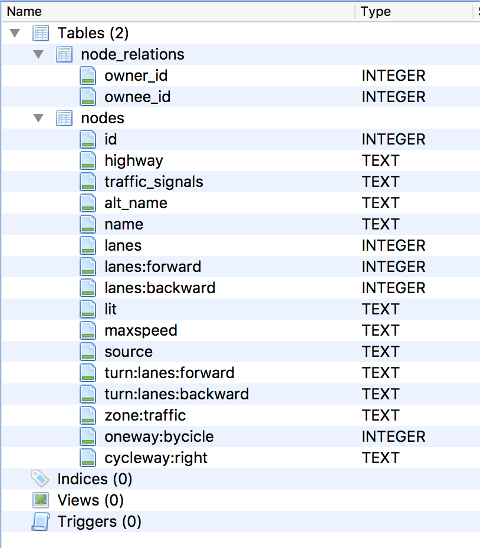
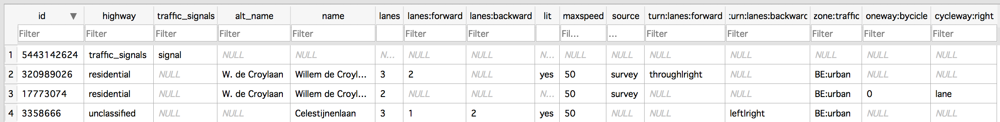
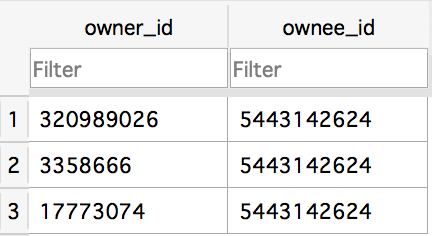
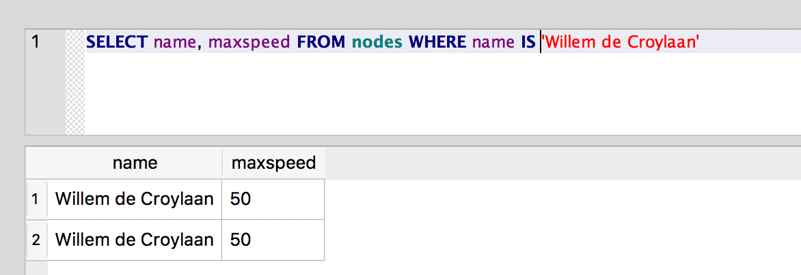
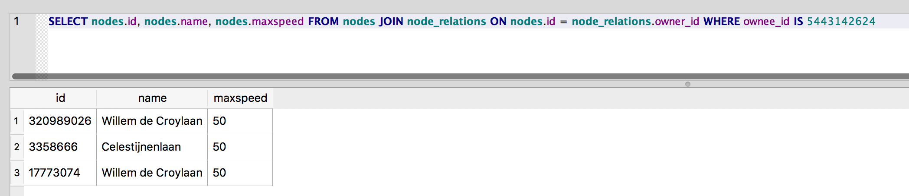

# Grounding of the world model for Celestijnenlaan example

Guys,

Michael Okoli <mailto:michaelchikezie.okoli@student.kuleuven.be> and I had a discussion after "class" about how to implement a perception graph in a concrete way. We chose the Celestijnenlaan crossing example and based ourselves on the OpenStreetMap data sent by Prof. Herman. Then, we implemented the perception graph for that using SQLite. The final SQLite .db file is attached to this message.

## Why SQLite

We decided to use SQLite to represent the data in a structured fashion because it is lightweight, easy to use, and allows for queries in the SQL language. This way, we were able to quickly prototype to better understand some perception graph concepts like node-relationships and querying.

## Data structure

According to the OpenStreetMap data, there were 4 nodes to analyze: the traffic light, the Celestijnenlaan, and the right and left portions of the W. de Croylaan. We decided on two tables to represent the nodes, and the schema of the database is as follows:



All occurring semantic tags from the 4 nodes were used as columns for the `nodes` table, along with the `id` property that's just the node id on OpenStreetMap.

A second table called `node_relations` models the many-to-many relationship between nodes, where one of them is the owner and the other is the ownee.

## Data

After modeling the schema, we manually inputed the data for the 4 nodes, resulting in the tables below.

### Nodes table



### Node relations table



## Queries

With the data structure defined and the data present, we used the SQL querying language to try to answer two simple queries:

1.  What is the max speed on the W. de Croylaan?



This is a simple SELECT query for the maxspeed and name attribute on nodes whose name match 'Willem de Croylaan'.

2.  Which nodes are owners of the traffic light node?



This query executes a JOIN to traverse graph relationships and find those that have the Owner relationship with regard to node 5443142624, which is the traffic light.

## Insights

* We think we grasped the concept of perception graphs better now that we have a solid implementation we can query against.
* Data cleaning and structuring is hard, and OpenStreetMaps nodes often have incomplete information. For example, we expected nodes to give the range of the addresses on them, but this information wasn't available. Also, node semantic tags change even between pieces of the same road, like W. de Croylaan.
* For the use case of an autonomous vehicle, the OpenStreetMap data is not enough, we would need to combine it with additional information to know where we are in regards to the map so we can calculate the trajectory.

## Further questions

* How does the perception graph relate to the world model? Is the perception graph a model of the world on its own or do they both refer to the same concept?

* How to connect the task model with the necessary queries to obtain the information? Can it be hardcoded on the plan or should the AI agent be able to create queries on its own, and if so, what are some possible solutions for that?

## Schema

```SQL
CREATE TABLE "nodes" (
  `id` INTEGER UNIQUE,
  `highway` TEXT,
  `traffic_signals` TEXT,
  `alt_name` TEXT,
  `name` TEXT,
  `lanes` INTEGER,
  `lanes:forward` INTEGER,
  `lanes:backward` INTEGER,
  `lit` TEXT,
  `maxspeed` TEXT,
  `source` TEXT,
  `turn:lanes:forward` TEXT,
  `turn:lanes:backward` TEXT,
  `zone:traffic` TEXT,
  `oneway:bycicle` INTEGER,
  `cycleway:right` TEXT
)
```

```SQL
CREATE TABLE `node_relations` (
  `owner_id` INTEGER,
  `ownee_id` INTEGER
)
```
